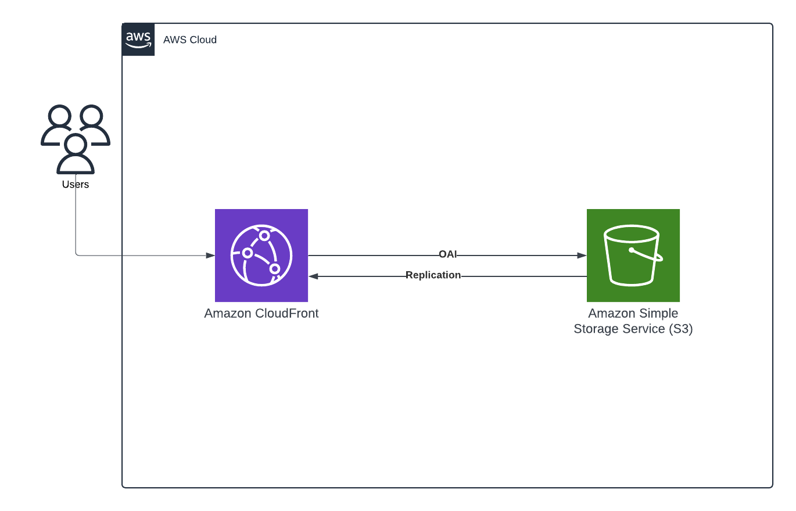

# Static Website Deployment with Terraform

This project demonstrates how to deploy a static website to AWS S3 using Terraform. The website consists of a single HTML file (`index.html`) that includes embedded CSS and JavaScript.

## Prerequisites

Before you begin, ensure you have the following installed:

- [Terraform](https://www.terraform.io/downloads.html)
- AWS Programmatic access enabled User AWS account with appropriate permissions to create S3 buckets and objects



## Project Structure

The project directory should have the following structure:

- `providers.tf` : for declaring provider for aws and profile for programmatic access 
- `index.html`: The HTML file for your static website.
- `main.tf`: The Terraform configuration file for creating S3 bucket with all access.
- `cloudfront.tf` : The Terraform configuration for cloudfront deployment 
- `outputs.tf` : The output file to pull out the cloudfront domain name and S3 bucket name
- `variables.tf` : for declaring variables 


## Step-by-Step Guide

### 1. Configure AWS Credentials 

First, configure your aws user profile in VS code or your AWS CLI with your credentials

### 2. Create a `providers.tf` file with the following content:

```hcl
terraform {
  required_providers {
    aws = {
      source = "hashicorp/aws"
    }
  }
}


provider "aws" {
  region                   = "us-east-1"
  shared_credentials_files = ["~/.aws/credentials"]
  profile                  = "your-username"
}
```
### 3. Create `index.html`

Create a sample index.html with the elements of your choice , i did one just for making a example to host in s3 and replicating in cloudfront

### 4. Add all the `.tf` files in the same directory

pull these `main.tf` , `outputs.tf` , `providers.tf` , `cloudfront.tf` and `variables.tf` and add them in the same directory before running terraform.

### 5. Run terraform

Run the following CLI commands to perform this terraform codes.

```
terraform init
terraform validate
terraform plan
terraform apply -auto-approve
```

#### Hope you can run it in your machine, let me know if any issues witht the code snippet , steps and anything it is always open for improvement.

## please dont forget to run "terraform destroy" to DESTROY the resources once done!!


